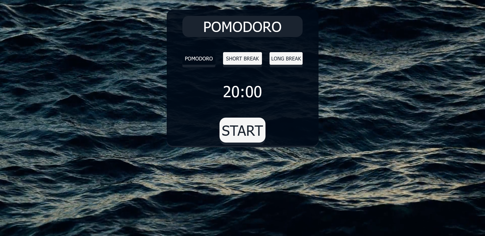

# About

A Promodo timer. Promodo is one of my favourite focus methods for studying and coding. I've found many Promodo timers on the internet and wanted to make my own version. I chose the deep blue color and ocean waves as they are soothing to the eye and you definetly want to be in the best state of mind when you start Promodo!

# Table of Contents

- [Local Setup](#local-setup)
- [Technologies Used](#technologies-used)
- [What I learned](#what-i-learned)
- [Credits](#credits)

## Local Setup

Download or clone from github.
Install dependencies using npm install

`npm install`
Change the port to localhost

Run locally with npm run start

`npm start`

## Technologies Used

- React
- React-Redux
- Redux-Toolkit
- Material UI
- CSS

This is React project, with Material UI and some CSS for styling.

Initially I created the project to run with local state using the useState hook.

Then I converted the local state to a global state using React-Redux and Redux-Toolkit.The previous version of the Promodo component can be found in PromodoWithoutRedux

## What I learned

- How to add a video as the background
- How to optimize the video
- Simple button animation using CSS
- State management using Slices with React-Redux and Redux-Toolkit

Resources Used:

- This article on optimizing video backgrounds by [Logrocket](https://blog.logrocket.com/optimizing-video-backgrounds-css-javascript/#making-video-backgrounds-responsive)
- This article on CSS animation by [W3Schools](https://www.w3schools.com/howto/howto_css_animate_buttons.asp)
- The Redux Toolkit Quick Start [Tutorial](https://redux-toolkit.js.org/tutorials/quick-start)

## Credits

Video from pixelbay free for personal use license

Wine Sea video by [Rostislav Uzunov](https://pixabay.com/users/rostislavuzunov-8621397/?utm_source=link-attribution&utm_medium=referral&utm_campaign=video&utm_content=71122) from [Pixabay](https://pixabay.com//?utm_source=link-attribution&utm_medium=referral&utm_campaign=video&utm_content=71122)

Sounds from pixelbay free for personal use license

Mech Keyboard Sound Effect from [Pixabay](https://pixabay.com/?utm_source=link-attribution&utm_medium=referral&utm_campaign=music&utm_content=102918)

Ding Sound Effect from [Pixabay](https://pixabay.com/sound-effects/?utm_source=link-attribution&utm_medium=referral&utm_campaign=music&utm_content=47489)

Icon from [Flaticon](https://www.flaticon.com/free-icons/sand)
